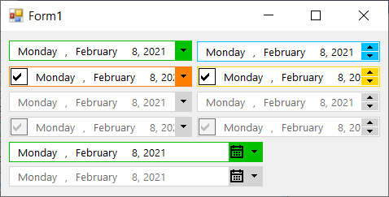

# FlatDateTimePicker

This example contains a `FlatDateTimePicker` control which is basically a derived control from `DateTimePicker` having a `BorderColor` property and based on that, the border, the dropdown button and the updown button has been rendered in a flat style. It also has fixed the ugly rendering of the checkbox:

To handle the painting of the border, dropdown and the checkbox area, I've handled [WM_PAINT](https://docs.microsoft.com/en-us/windows/win32/gdi/wm-paint?WT.mc_id=DT-MVP-5003235) and drew the border and button and checkbox. Also to get the accurate size of the dropdown, I've sent [DTM_GETDATETIMEPICKERINFO](https://docs.microsoft.com/en-us/windows/win32/controls/dtm-getdatetimepickerinfo?WT.mc_id=DT-MVP-5003235) message.

To customize the rendering of the updown part, a [DTM_GETDATETIMEPICKERINFO](https://docs.microsoft.com/en-us/windows/win32/controls/dtm-getdatetimepickerinfo?WT.mc_id=DT-MVP-5003235) message ahs been sent and found the handle of updown control. Then using a NativeWindow the [WM_PAINT](https://docs.microsoft.com/en-us/windows/win32/gdi/wm-paint?WT.mc_id=DT-MVP-5003235) message of updown control has been handled.